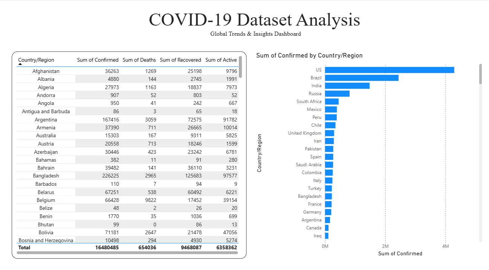
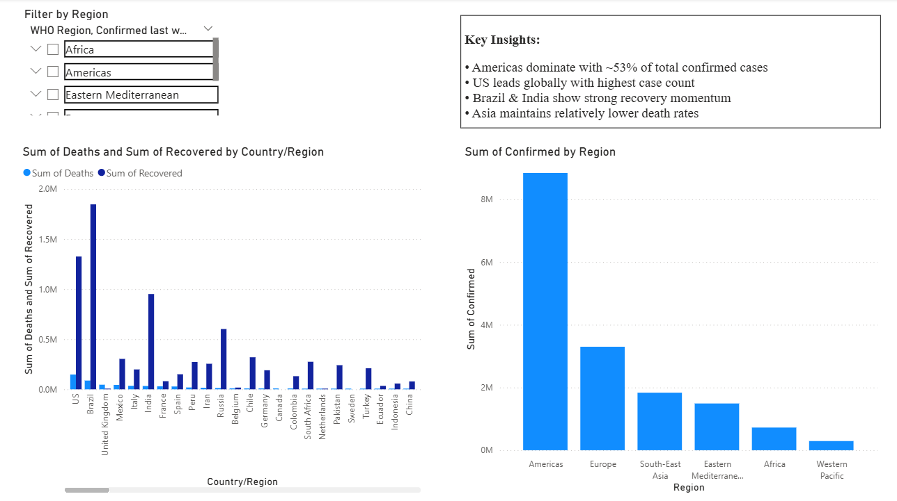
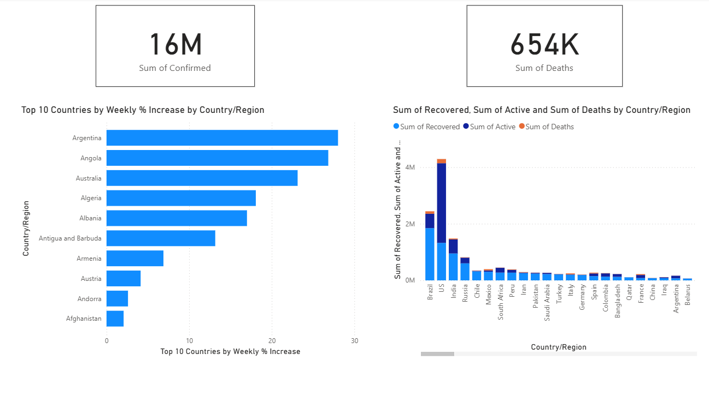

📊 COVID-19 Dashboard Analysis (Power BI)

Project Overview

This project presents an interactive Power BI dashboard analyzing global COVID-19 trends, including confirmed cases, deaths, recoveries, and regional distribution.

Tools Used

* Power BI
* Data Visualization
* Data Analysis

Key Features

* KPI metrics for total confirmed cases and deaths
* Top 10 countries by weekly % increase
* Region-wise case distribution
* Interactive filters (Region slicer)
* Country-level comparison charts

Key Insights

* Americas dominate with ~53% of total confirmed cases
* US leads globally with highest case count
* Brazil & India show strong recovery momentum
* Asia maintains relatively lower death rates

Dashboard Preview

How to Use

1. Download the covid_analysis.pbix file
2. Open using Power BI Desktop
